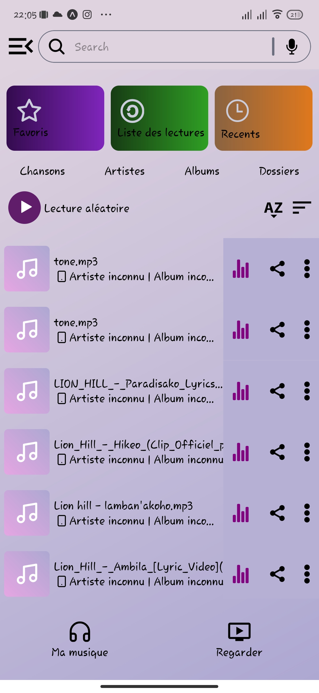
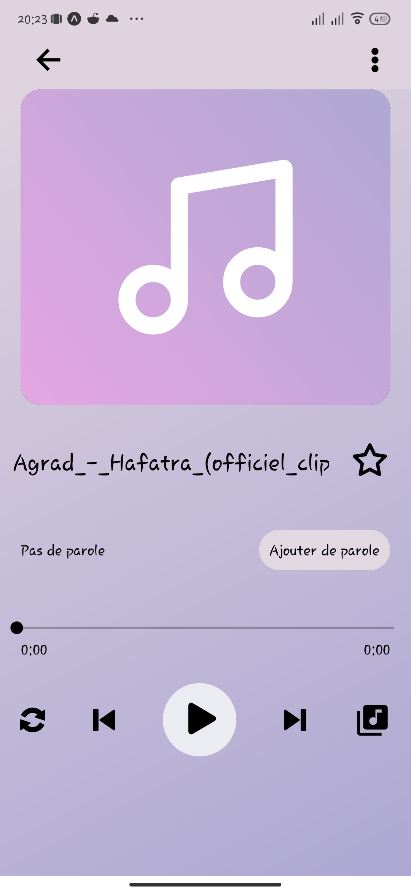
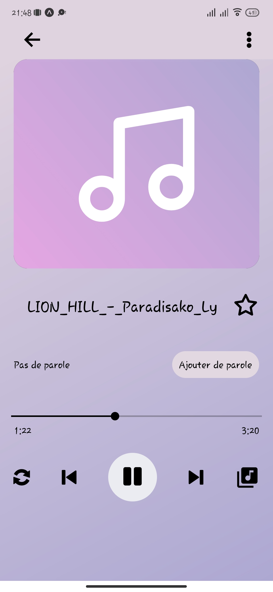

    
    

## About project

An Android application for listening to music created using <a href="https://reactnative.dev/docs/getting-started">React Native</a> and <a href="https://docs.expo.dev/">Expo</a>.

## Visual interface

